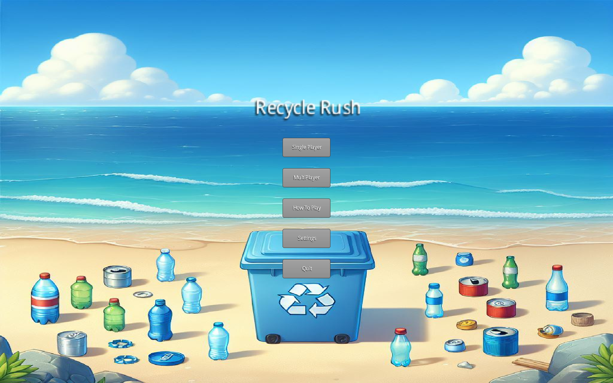
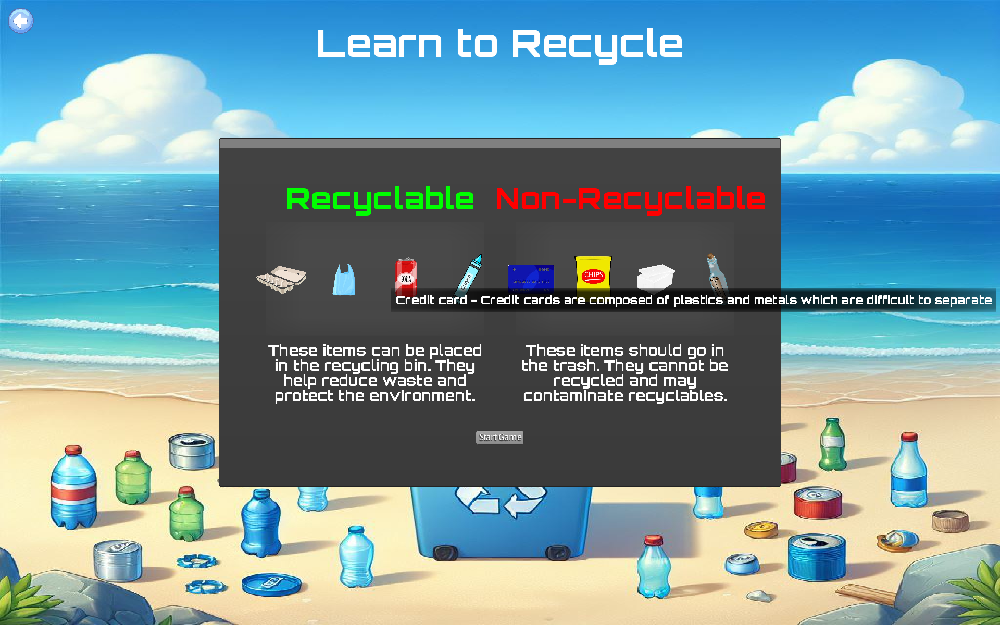
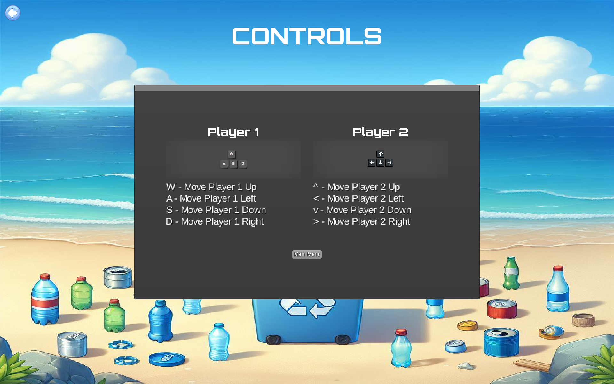
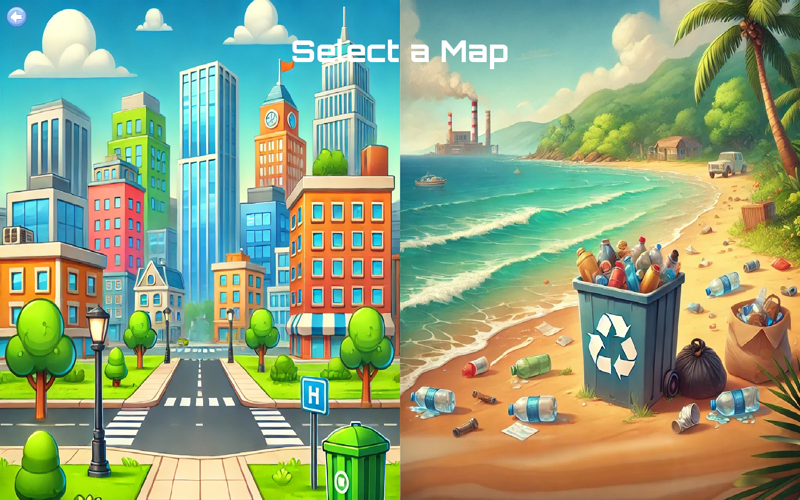
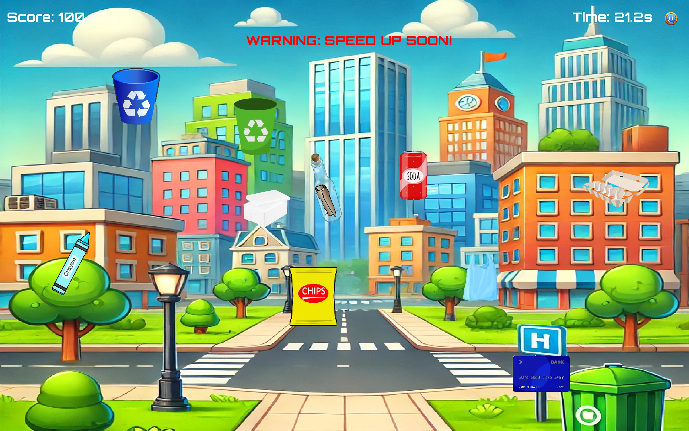
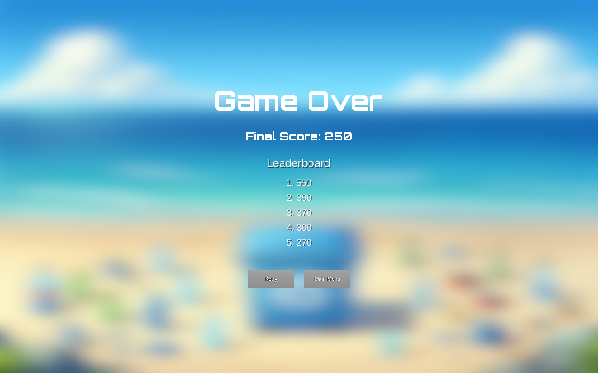

# ♻️ Recycle Rush

**Recycle Rush** is a 2D game built with **LibGDX**, developed as part of an academic project to apply core principles of **Object-Oriented Programming (OOP)** in Java. The game reinforces software engineering best practices by focusing on the **4 pillars of OOP** — encapsulation, abstraction, inheritance, and polymorphism — while incorporating the **SOLID principles** and key **design patterns**.

---

## Project Objectives

- Practise and demonstrate understanding of Object-Oriented Programming (OOP)
- Apply **SOLID principles** to enhance maintainability and scalability
- Implement key design patterns such as:
  - **Singleton** (e.g., managing core managers and configurations)
  - **Factory** (e.g., dynamic object/entity creation)
  - **Strategy** (e.g., modular movement or behavior logic)
  - **Observer** (e.g., event-based communication between components)

---

## Architecture Overview

This project follows a **layered architecture** design:

### Abstract Game Engine Layer
- Defines high-level reusable game logic and interfaces
- Promotes decoupling and extensibility

### Concrete Implementation Layer
- Builds the actual game experience (Recycle Rush) on top of the abstract engine
- Implements game-specific mechanics like screen flows, score handling, and entity management

---

## Key Components

## Key Components

- `**GameMaster1.java**`  
  - Acts as the central orchestrator  
  - Oversees the game lifecycle (`create()`, `render()`, `dispose()`)  
  - Facilitates structured interactions between various subsystems  

- `**EntityManager**`  
  - Manages dynamic game entities like players and obstacles  
  - Supports entity lifecycle management  

- `**ScreenManager**`  
  - Manages all in-game screens using identifiers  
  - Uses a **Singleton Factory Pattern** to ensure consistent screen creation and reuse  
  - Promotes resource efficiency and consistent screen flow  

- `**IOManager**`  
  - Handles user inputs through keyboard and touch  
  - Concrete input implementations extend from an abstract base class  
  - Promotes scalability and easy integration of new input types  

- `**SoundManager**`  
  - Loads and updates audio assets  
  - Emphasises **encapsulation** with controlled setters/getters  
  - Prevents abrupt changes and ensures consistent audio behaviour  

- `**MovementManager**`  
  - Handles various movement logic for entities  
  - Follows the **Dependency Inversion Principle**  
  - Entities rely on movement interfaces for flexibility and modularity  

- `**CollisionManager**`  
  - Manages collision detection and response  
  - Implements the **Strategy Design Pattern**  
  - Allows flexible and interchangeable collision behaviours  

- `**ButtonManager**`  
  - Handles creation and interaction of UI buttons  
  - Utilises the **Observer Design Pattern**  
  - Notifies listeners of player actions for clean UI-game logic separation  


---

## Features

- Map selection and multiple screens
- Players can choose different maps and navigate through various screens such as Start, Game, Settings, and Game Over.
- Dynamic entity system with scoring and persistent leaderboard – Objects are dynamically managed during gameplay, with scores tracked and saved for replay value.
- Educational screen – A dedicated screen informs players about the recyclability of items, adding an educational layer to gameplay.
- Modular movement and collision systems – Movement behaviors and collision detection are decoupled and interchangeable, promoting flexibility and scalability.

## Future Improvements

- Introduce AI-controlled NPCs with different behaviours
- Implement power-ups and item modifiers to boost gameplay variety
- Develop a network multiplayer mode
- Refactor rendering pipeline and asset loading for performance optimizations


---

## Acknowledgements

- Developed as a group project for our Object-Oriented Programming (OOP) module
- Built with [LibGDX](https://libgdx.com/)
- Special thanks to our lecturer and teaching assistants for their support and feedback
- Gratitude to all team members for their contributions and collaboration throughout the project


## Getting Started

To run the game locally:

1. Clone the repository:
```
git clone https://github.com/BAC-Deacon/Libgdx-Game.git
```
2. Import the project into a Java IDE that supports Gradle (e.g. Eclipse).

3. Locate and run the DesktopLauncher class or your designated entry point.

* Ensure you have Java and Gradle properly installed on your system.

---


## 📸 Screenshots

> A glimpse into the Recycle Rush experience!

### 🏝️ Home Screen  
  
Navigate game modes, view how-to-play instructions, adjust settings, or exit.

---

### 📚 Educational Screen  
  
Learn the difference between recyclable and non-recyclable items through an interactive info screen.

---

### 🕹️ Controls  
  
Detailed player control guide for both single and multiplayer modes.

---

### 🌍 Map Selection  
  
Players can choose between different game environments like the city or the beach for a varied experience.

---

### 🗑️ Gameplay  
  
Catch falling items and sort them into the correct recycling bins before time runs out — with increasing difficulty!

---

### 💀 Game Over + Leaderboard  
  
Displays final score and a persistent leaderboard showing top high scores.
